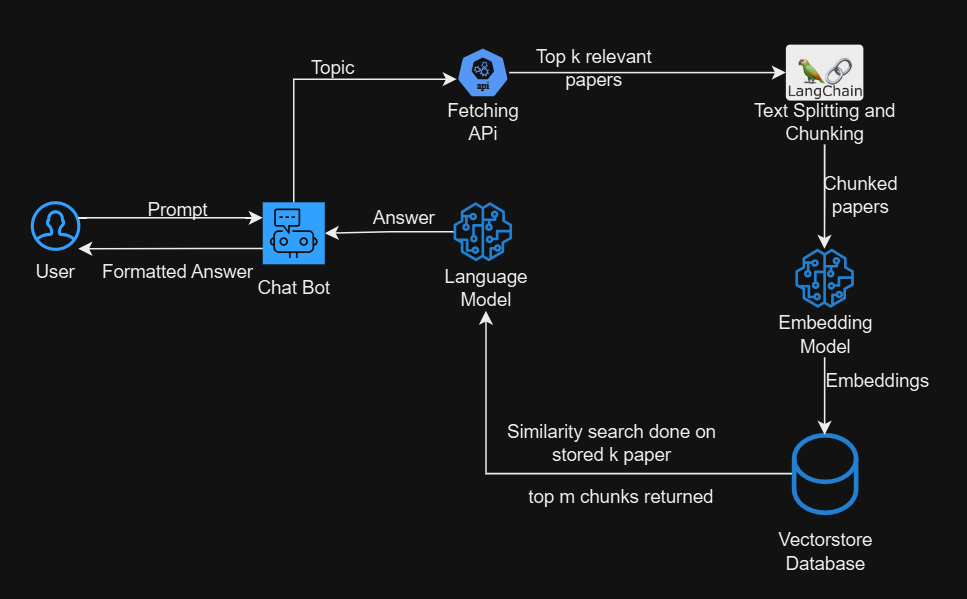

Here's a README file for the project using the provided architecture image and detailed explanation:

---

# Paper-Summarizer-Bot

## Overview

The Paper-Summarizer-Bot is a sophisticated system designed to fetch, chunk, embed, and summarize research papers. By leveraging LangChain, embedding models, and large language models, it aims to provide concise and accurate answers based on the latest research.

## Architecture

## Components

### 1. External Data Source
- **Data Collection**: Gather data from various web sources using APIs or web scrapers.
- **Storage**: Use SQL or NoSQL databases to store the structured data.
- **Pre-processing**: Employ Python libraries to clean and prepare the data for further processing.

### 2. Embedding Models
- **Data Types**: The collected data may include text, images, or videos.
- **Conversion to Numerical Data**: Transform the raw or preprocessed data into vector embeddings. This conversion captures semantic relationships between elements and encodes them in a numerical vector form.
- **Tools**: Utilize transformers like BERT, GPT, and Sentence Transformers (available via Hugging Face) to generate these embeddings.

### 3. Large Language Models
- **Input to LLMs**: Feed the vector embeddings into pre-trained LLMs.
- **Model Choices**: Use open-source models available on the HuggingFace website to process the embeddings and generate meaningful outcomes.

## Introduction To Retrieval Augmented Generation (RAG)

While generative approaches using Large Language Models (LLMs) like ChatGPT or LLaMA have revolutionized natural language processing, they are not without their limitations.

### Limitations of LLMs

- **Static Knowledge Base**:
  - **Outdated Information**: LLMs are trained on large, static datasets. Consequently, they cannot update or acquire new information after training, making them unsuitable for tasks requiring the latest or dynamically changing data.
  - **Lack of Real-time Context**: These models struggle to provide up-to-date answers without real-time data access, particularly in rapidly evolving domains.
  
- **Generic Responses**:
  - **Broad Training Scope**: LLMs are trained on expansive and diverse datasets to effectively comprehend and generate human language. This often leads to responses lacking the depth and specificity required in specialized fields. This generalist approach can also generate "hallucinated" content—responses that appear accurate and plausible but are factually incorrect or misleading.
  - **Insufficient Domain Expertise**: For domain-specific queries, such as technical documentation or niche knowledge areas, LLMs may fail to deliver precise and accurate responses, leading to generic or inaccurate answers.

## The RAG Approach

RAG combines the strengths of information retrieval systems with the generative abilities of Large Language Models (LLMs) to produce more accurate and contextually relevant responses.

### A) Retrieval

#### Retrievers
- **Function**: Identify and retrieve relevant data from external sources or databases based on the input query.
- **Mechanism**: Use algorithms to search through vast collections of documents or data to find the most pertinent information.
- **Types**:
  - **Dense Retrievers**: Use neural embeddings to understand semantic similarity (e.g., BERT-based retrievers).
  - **Sparse Retrievers**: Use traditional keyword-based methods (e.g., TF-IDF or BM25).

#### Rankers
- **Function**: Evaluate and rank the retrieved documents or data segments based on their relevance to the query.
- **Mechanism**: Apply scoring algorithms to prioritize the most relevant information.

### B) Augmentation

- **Function**: Enhance the raw input data (retrieved from documents provided) with additional information or context to improve the performance of language models during the query generation process.
- **Mechanism**: The raw data is enriched by combining the user query with the retrieved content to create a more informative input for the language model.

### C) Generation

- **Function**: Draft a comprehensive response using the retrieved information and query. It analyzes the key points and context from the retrieved information.
- **Mechanism**: The language models may personalize the response based on intent (sarcastic, poetic) or context.

For a more detailed explanation of RAGs, please go through [this research paper](https://arxiv.org/abs/2005.11401)(*Retrieval-Augmented Generation for Knowledge-Intensive NLP Tasks*).

### License

This project is licensed under the MIT License - see the [LICENSE](LICENSE) file for details.
